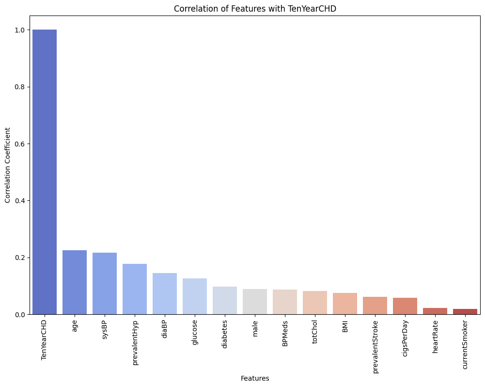

# Heart Disease Prediction Using Logistic Regression

## Overview
This project aims to predict the likelihood of heart disease using logistic regression. The dataset used for this analysis is from the Framingham Heart Study and includes various health metrics.

## Dataset
The dataset contains 4238 entries and 16 features:
- `male`: Gender (0 = Female, 1 = Male)
- `age`: Age of the patient
- `education`: Level of education
- `currentSmoker`: Whether the patient is a current smoker (0 = No, 1 = Yes)
- `cigsPerDay`: Number of cigarettes smoked per day
- `BPMeds`: Whether the patient is on blood pressure medication (0 = No, 1 = Yes)
- `prevalentStroke`: Whether the patient has had a stroke (0 = No, 1 = Yes)
- `prevalentHyp`: Whether the patient has hypertension (0 = No, 1 = Yes)
- `diabetes`: Whether the patient has diabetes (0 = No, 1 = Yes)
- `totChol`: Total cholesterol level
- `sysBP`: Systolic blood pressure
- `diaBP`: Diastolic blood pressure
- `BMI`: Body Mass Index
- `heartRate`: Heart rate
- `glucose`: Glucose level
- `TenYearCHD`: Whether the patient has coronary heart disease within 10 years (0 = No, 1 = Yes)

## Data Preprocessing
- **Handling Missing Values**: Missing values were handled by filling with median or mean values as appropriate.
- **Dropping Columns**: The `education` column was dropped due to a high percentage of missing values.
- **Removing Outliers**: Outliers were removed from key features: `age`, `sysBP`, `diaBP`, and `glucose`.

## Feature Engineering
- Created an interaction feature `age_BMI_interaction` as the product of `age` and `BMI`.

## Data Visualization
- **Correlation Analysis**: Correlation of features with the target variable `TenYearCHD` was computed and visualized.
- **Feature Distribution**: Box plots and histograms were used to visualize the distribution of top features.

## Model Training
- **Model**: Logistic Regression
- **Evaluation Metrics**: Accuracy, Confusion Matrix, Recall, Precision, F1 Score, and ROC Curve.

## Results
- **Accuracy**: 86.79%
- **Confusion Matrix**:
[[598 1]
[ 90 0]]

- **Recall**: 0.0
- **ROC Curve**: See the plot below for the Receiver Operating Characteristic (ROC) curve.

## Plots
### Correlation of Features with TenYearCHD

### Distribution of Key Features

### ROC Curve

## Future Work
- Experiment with other classification algorithms.
- Explore additional feature engineering techniques.
- Improve model performance and handle class imbalance.

## License
This project is licensed under the MIT License.

## Acknowledgements
- Dataset: Framingham Heart Study
- Libraries: pandas, numpy, matplotlib, seaborn, scikit-learn
